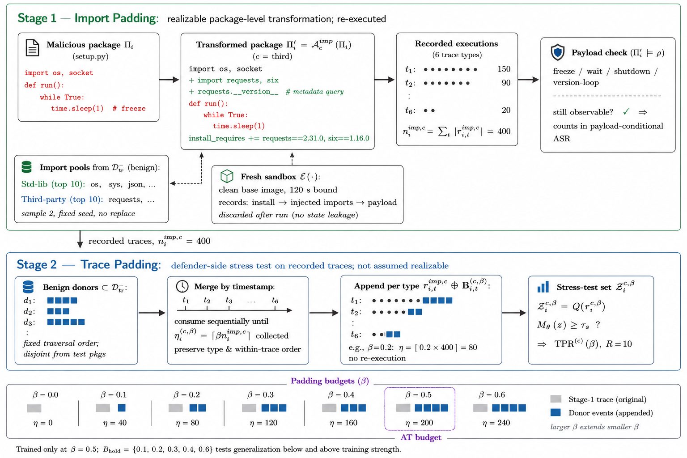

# Phase (vi): Adversarial Attack and Training

<p align="center">
  
</p>
<p align="center"><b>Figure 1: Adversarial Training Process.</b></p>

This directory contains the notebooks used to evaluate adversarial attacks and adversarial training across three import-padding strategies and six padding budgets.

## Experimental Design

The experiments are organized into two main phases:

1. **Adversarial Attacks Test**  
   Evaluates the trained detector against adversarially padded package traces.

2. **Adversarial Attacks Training**  
   Evaluates models trained with adversarial examples. These experiments are marked with **+ AT**, where **AT** denotes adversarial training.

Each phase contains three import-padding strategies:

- **Combined Import**
- **Standard Import**
- **Third-party Import**

Each strategy is evaluated at six padding budgets:

- 10% padding
- 20% padding
- 30% padding
- 40% padding
- 50% padding
- 60% padding

## Directory Structure

```text
Phase (v) Adversarial Attack and Training/
│
├── README.md
│
├── Adversarial Attacks Test/
│   │
│   ├── Combined Import/
│   │   ├── 10% Padding/
│   │   │   └── combined_import_10pct.ipynb
│   │   ├── 20% Padding/
│   │   │   └── combined_import_20pct.ipynb
│   │   ├── 30% Padding/
│   │   │   └── combined_import_30pct.ipynb
│   │   ├── 40% Padding/
│   │   │   └── combined_import_40pct.ipynb
│   │   └── 60% Padding/
│   │       └── combined_import_60pct.ipynb
│   │
│   ├── Standard Import/
│   │   ├── 10% Padding/
│   │   │   └── standard_import_10pct.ipynb
│   │   ├── 20% Padding/
│   │   │   └── standard_import_20pct.ipynb
│   │   ├── 30% Padding/
│   │   │   └── standard_import_30pct.ipynb
│   │   ├── 40% Padding/
│   │   │   └── standard_import_40pct.ipynb
│   │   └── 60% Padding/
│   │       └── standard_import_60pct.ipynb
│   │
│   └── Third-party Import/
│       ├── 10% Padding/
│       │   └── third_party_import_10pct.ipynb
│       ├── 20% Padding/
│       │   └── third_party_import_20pct.ipynb
│       ├── 30% Padding/
│       │   └── third_party_import_30pct.ipynb
│       ├── 40% Padding/
│       │   └── third_party_import_40pct.ipynb
│       └── 60% Padding/
│           └── third_party_import_60pct.ipynb
│
└── Adversarial Attacks Training/
    │
    ├── Combined Import + AT/
    │   ├── 50% Padding/
    │       └── combined_import_at_50pct.ipynb
    │
    ├── Standard Import + AT/
    │   ├── 50% Padding/
    │       └── standard_import_at_50pct.ipynb
    │
    └── Third-party Import + AT/
        ├── 50% Padding/
            └── third_party_import_at_50pct.ipynb

```

## Notebook Naming Convention

Notebook names follow this pattern:

```text
<import_strategy>[_at]_<padding_budget>pct.ipynb
```

Examples:

```text
combined_import_10pct.ipynb
standard_import_40pct.ipynb
third_party_import_at_50pct.ipynb
```

The `_at` suffix indicates that adversarial training is applied.

---
