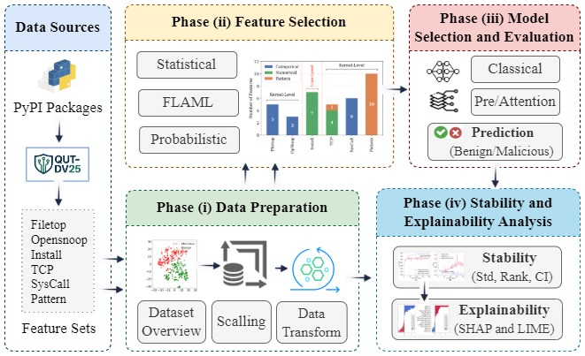

#### A Deep Learning-based Explainable Dynamic Analysis Framework for Detecting Malicious Packages in the PyPI Ecosystem


    


## Overview

eDySec is an efficient, stable, and explainable DL-based dynamic analysis framework for detecting malicious packages. It is designed to address the high-dimensional, sparse, and heterogeneous nature of dynamic behavioral data. As illustrated in Figure, eDySec consists of four main phases: 

- Data Preparation    
- Feature Selection    
- Model Selection and Evaluation    
- Stability and Explainability Analysis   


<p align="center">
  
</p>


## Dataset Overview

The experiments were conducted on the **QUT-DV25** dataset, a dynamic behavioral dataset designed for malicious package detection in the **PyPI ecosystem**.

### Dataset Summary

- **Dataset Name:** QUT-DV25
- **Target Task:** Binary classification of benign and malicious Python packages
- **Ecosystem:** PyPI
- **Total Packages:** 14,271 (7,127 malicious packages)
- **Analysis Type:** Dynamic behavioral analysis
- **Execution Phases:** Install-time and post-installation
- **Trace Categories:** Filetop, Opensnoop, Install, TCP, SysCall, Pattern
- **Feature Representation:** Individual trace-based features and a combined feature space
- **Output Classes:** Benign / Malicious
- **Dataset DOI:** https://doi.org/10.7910/DVN/LBMXJY


## Running Prerequisites

Before running the project, ensure that the following requirements are satisfied.

### 1. Experimental Environment

The analysis and experiments for eDySec were conducted in a controlled hardware environment with the following specifications.

- **Processor:** 13th Gen Intel Core i9-13900K
- **Memory:** 128 GB RAM
- **GPU:** NVIDIA RTX A6000 with 48 GB memory
- **Operating System:** Ubuntu 22.04 LTS (64-bit)

### 2. Python Version

Use **Python 3.10**.

### 3. Running Instructions

### Option 1: pip

```bash
git clone https://github.com/tanzirmehedi/eDySec.git
cd eDySec
python -m venv venv
source venv/bin/activate   # On Windows: venv\Scripts\activate
pip install -r requirements.txt
```

### Option 2: conda

```bash
conda create -n edysec python=3.10 -y
conda activate edysec
pip install -r requirements.txt
```

### 4. Required Python Packages

Typical packages used throughout the project include:

```bash
pandas==1.5.3
scikit-learn==1.2.2
numpy==1.23.5
scipy==1.9.3
tensorflow==2.11.0
matplotlib==3.7.1
seaborn==0.12.2
joblib==1.3.2
shap==0.41.0
flaml==2.5.0
notebook==6.5.6
transformers==4.49.0
```

### 5. Jupyter Notebook

To launch Jupyter Notebook:

```bash
pip install notebook
jupyter notebook
```

### 6. Dataset Availability

The project expects the **QUT-DV25 dataset** and its trace-category folders to be present under:

```bash
Phase (i) Data Preparation/QUT-DV25 Dataset/
```

Make sure the dataset files remain in their original repository structure before running the notebooks.


## Repository Structure

```bash
eDySec/
├── Phase (i) Data Preparation/
│   ├── QUT-DV25 Dataset/
│   │   ├── QUT-DV25_Filetop_Traces/
│   │   ├── QUT-DV25_Install_Traces/
│   │   ├── QUT-DV25_Opensnoop_Traces/
│   │   ├── QUT-DV25_Pattern_Traces/
│   │   ├── QUT-DV25_SysCall_Traces/
│   │   └── QUT-DV25_TCP_Traces/
│   ├── Dataset Overview.ipynb
│   ├── dataset_overview.png
│   ├── qutdv25_trace_sources.png
│   ├── t-SNE Implementation.ipynb
│   ├── tsne_Dynamic.png
│   ├── tsne_Metadata.png
│   └── tsne_Static.png
├── Phase (ii) Feature Selection/
│   ├── Feature Selection Methods/
│   │   ├── ANOVA/
│   │   ├── CORR/
│   │   ├── FLAML/
│   │   ├── PSO/
│   │   └── WOA/
│   ├── Feature Selection Result/
│   │   ├── Combined.xlsx
│   │   ├── Filetop.xlsx
│   │   ├── Install.xlsx
│   │   ├── Opensnoop.xlsx
│   │   ├── Pattern.xlsx
│   │   ├── SysCall.xlsx
│   │   └── TCP.xlsx
│   ├── Feature Selection Overview.csv
│   ├── Features Selection Overview.ipynb
│   ├── feature_selection.png
│   └── six_feature_selection.png
├── Phase (iii) DL Model Selection & Evaluation/
│   ├── ANOVA/
│   └── FLAML/
├── Phase (iv) Stability & Explainability/
│   ├── Explainability Analysis/
│   │   ├── LIME Outputs/
│   │   ├── SHAP Outputs/
│   │   └── FLAML DL MLP Combined XAI.ipynb
│   └── Stability Analysis/
│       ├── Stability Analysis Outputs/
│       └── Stability Analysis.ipynb
├── Related Works/
├── LICENSE
└── README.md
```


## How to Run the Project

The repository follows a four-phase execution workflow. For reproducibility and consistency, run the notebooks in the order below.

### Phase 1: Data Preparation

This phase introduces the dataset structure and provides visualization of the underlying data distributions.

Run the following notebooks:

``bash
Phase (i) Data Preparation/Dataset Overview.ipynb    
Phase (i) Data Preparation/t-SNE Implementation.ipynb
``

This phase produces:

* dataset overview outputs
* trace source visualizations
* t-SNE visualizations for dynamic, metadata, and static perspectives

### Phase 2: Feature Selection

This phase applies the feature selection methods used in the study.

Go to:

```bash
Phase (ii) Feature Selection/Feature Selection Methods/
```

The available methods are:

* **ANOVA**
* **CORR**
* **FLAML**
* **PSO**
* **WOA**

For each method, run the notebook corresponding to the required trace category.

Example:

```bash
Phase (ii) Feature Selection/Feature Selection Methods/ANOVA/Feature_Selection_Combined_ANOVA.ipynb
Phase (ii) Feature Selection/Feature Selection Methods/ANOVA/Feature_Selection_Filetop_ANOVA.ipynb
Phase (ii) Feature Selection/Feature Selection Methods/ANOVA/Feature_Selection_Install_ANOVA.ipynb
```

Run the corresponding notebooks in the same way for CORR, FLAML, PSO, and WOA.

The generated and consolidated feature selection outputs are available under:

```bash
Phase (ii) Feature Selection/Feature Selection Result/
```

### Phase 3: Model Selection and Evaluation

This phase trains and evaluates the deep learning models using the selected feature subsets.

Go to:

```bash
Phase (iii) DL Model Selection & Evaluation/
```

Choose the desired feature selection method directory, such as:

```bash
ANOVA/
FLAML/
```

Then open the required trace-category folder and run the corresponding notebook.

Example:

```bash
Phase (iii) DL Model Selection & Evaluation/ANOVA/Combined/Combined_ANOVA_BERT.ipynb
Phase (iii) DL Model Selection & Evaluation/ANOVA/Combined/Combined_ANOVA_DistilGPT2.ipynb
Phase (iii) DL Model Selection & Evaluation/ANOVA/Combined/Combined_ANOVA_LSTM.ipynb
Phase (iii) DL Model Selection & Evaluation/ANOVA/Combined/Combined_ANOVA_RNN.ipynb
Phase (iii) DL Model Selection & Evaluation/ANOVA/Combined/Combined_ANOVA_Transformer.ipynb
```

Each notebook generates evaluation outputs inside its corresponding output directory, including:

* confusion matrices
* ROC curves
* learning curves
* evaluation summary files
* training logs

### Phase 4: Stability and Explainability Analysis

This phase performs comparative stability analysis across models and feature selection methods.

Run:

```bash
Phase (iv) Stability & Explainability/Stability Analysis/Stability Analysis.ipynb
```

This notebook generates outputs in:

```bash
Phase (iv) Stability & Explainability/Stability Analysis/Stability Analysis Outputs/
```

Typical outputs include:

* mean-std-rank summaries
* heatmaps of model performance
* category-wise comparison plots
* critical difference diagram using Friedman and Nemenyi analysis
* p-value comparison matrices
* compact summaries of best-performing models


This phase generates SHAP- and LIME-based explanations for the best-performing configuration.

Run:

```bash
Phase (iv) Stability & Explainability/Explainability Analysis/FLAML DL MLP Combined XAI.ipynb
```

This notebook produces outputs in:

```bash
Phase (iv) Stability & Explainability/Explainability Analysis/LIME Outputs/
Phase (iv) Stability & Explainability/Explainability Analysis/SHAP Outputs/
```

Typical outputs include:

* SHAP global feature importance plots
* SHAP summary and waterfall plots
* LIME dashboards
* local explanations for benign and malicious samples
* instance-level explanation files in HTML and PNG formats


## Recommended End-to-End Execution Order

For a full reproduction of the project workflow, run the repository in the following order:

1. `Dataset Overview.ipynb`
2. `t-SNE Implementation.ipynb`
3. feature selection notebooks for the chosen method(s)
4. deep learning evaluation notebooks for the selected features
5. `FLAML DL MLP Combined XAI.ipynb`
6. `Stability Analysis.ipynb`

## Main Outputs

The repository generates the following outputs:

* dataset overview figures
* trace source figures
* t-SNE visualizations
* selected feature summaries
* confusion matrices
* ROC curves
* learning curves
* evaluation summary files
* training logs
* SHAP explanations
* LIME dashboards and local explanations
* stability analysis figures and statistical reports

## Best Reported Configuration

The strongest reported configuration in this repository is:

* **Combined traces**
* **FLAML feature selection**
* **MLP model**

This configuration is also used in the explainability phase.

## Citation

```bibtex
@article{mehedi2026edysec,
  title   = {eDySec: A Deep Learning-based Explainable Dynamic Analysis for Detecting Malicious Packages in the PyPI Ecosystem},
  author  = {Will be added},
  year    = {will be added}
}
```

## License

This project is distributed under the terms specified in the `LICENSE` file.


