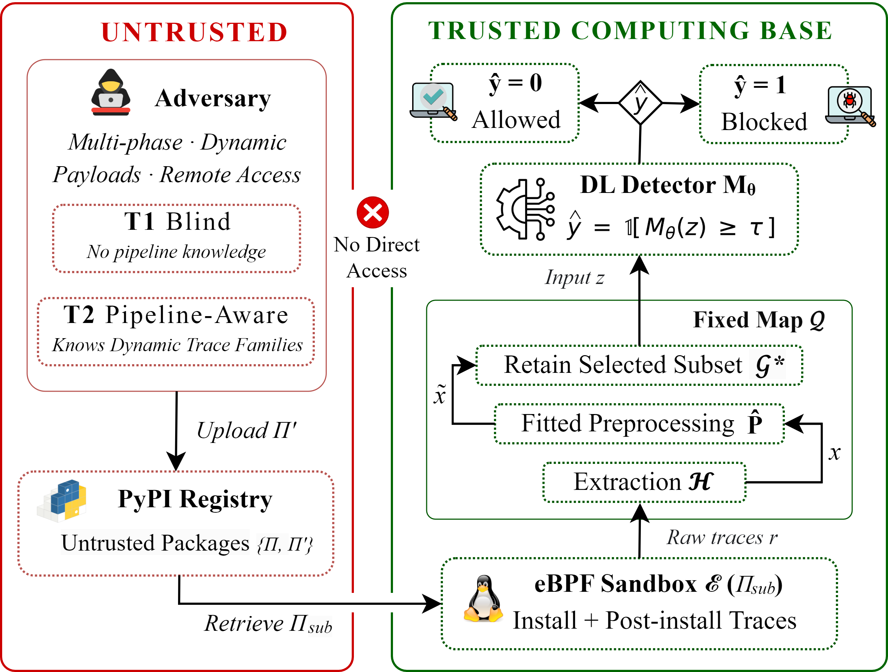

## Detecting Malicious PyPI Packages from Execution Traces: An Empirical Study

**Replication package for empiDySec (Empirical Dynamic Security)**

[](https://www.python.org/)
[](#dataset-qut-dv25)
[](#study-overview)
[](#phase-iii-model-selection-and-evaluation)
[](#phase-vi-adversarial-attack-and-training)
[](#license)

## Study Overview

This repository contains the non-sensitive replication artifacts for an empirical study of deep-learning-based detection of malicious PyPI packages from **install-time and post-installation behavior**. The study examines whether detection depends more on behavioral representation quality than on additional architectural complexity, and evaluates adaptive robustness, run-to-run stability, explainability, and package-level validity within one fixed pipeline.

<p align="center">
  
</p>
<p align="center"><b>Figure 1. System and threat model. Pi and Pi-prime denote the original package and its transformed adversarial variant.</b></p>

The evaluation uses the publicly available **QUT-DV25** dataset, which records aggregate system-call, file, installation, network, resource-use, dependency, and execution-pattern behavior. The repository is organized into six experimental phases:

- **Phase (i): Data Preparation**
- **Phase (ii): Feature Selection**
- **Phase (iii): Model Selection and Evaluation**
- **Phase (iv): Stability and Explainability**
- **Phase (v): Baseline Comparison**
- **Phase (vi): Adversarial Attack and Training**

## Research Questions

The paper addresses four research questions:

- **RQ1 — Representation and detection:** Which combination of behavioral representation and learning architecture yields accurate, low-latency detection from install-time and post-installation traces?
- **RQ2 — Adaptive robustness:** How robust is detection against adaptive, package-realizable transformations that must preserve malicious behavior?
- **RQ3 — Stability:** How stable are the resulting detectors across repeated training runs?
- **RQ4 — Explainability:** Do post-hoc explanations attribute verdicts to meaningful security behavior?

### Phase-to-question mapping

| Repository phase | Purpose | Research question |
| --- | --- | --- |
| Phase (i) Data Preparation | Prepare the fixed split and characterize the trace sources | RQ1 |
| Phase (ii) Feature Selection | Compare statistical, AutoML, and metaheuristic selectors | RQ1 |
| Phase (iii) Model Selection and Evaluation | Train and select DL architectures using validation-only criteria | RQ1 |
| Phase (iv) Stability and Explainability | Measure repeated-run variation and generate post-hoc explanations | RQ3, RQ4 |
| Phase (v) Baseline Comparison | Compare the selected detector with ML baselines and audit prediction-label disagreements | RQ1 and operational validation |
| Phase (vi) Adversarial Attack and Training | Evaluate behavior-preserving import padding and adversarial training | RQ2 |

## Dataset: QUT-DV25

QUT-DV25 is a labeled dynamic-behavior dataset for malicious-package detection in the PyPI ecosystem.

<p align="center">
  
</p>
<p align="center"><b>Figure 2. QUT-DV25 dataset overview and class distribution.</b></p>

| Property | Value |
| --- | --- |
| Dataset | QUT-DV25 |
| Ecosystem | PyPI |
| Task | Binary classification: benign or malicious |
| Packages | 14,271 |
| Malicious packages | 7,127 |
| Benign packages | 7,144 |
| Observation phases | Install-time and post-installation |
| Aggregate attributes | 36 |
| Trace sources | Filetop, Opensnoop, Install, TCP, SysCall, Pattern |
| Evaluated representations | Individual trace sources and Combined |
| DOI | <https://doi.org/10.7910/DVN/LBMXJY> |

### Trace sources

| Trace source | Recorded behavior |
| --- | --- |
| **Filetop** | File I/O activity and process-level file interactions |
| **Opensnoop** | File-open operations and accessed paths |
| **Install** | Installation activity, dependencies, and setup behavior |
| **TCP** | Network communication activity |
| **SysCall** | System-call activity observed during execution |
| **Pattern** | Aggregate state-transition and execution-pattern behavior |
| **Combined** | Joint representation formed from all six sources |

The reported reduction from 36 to 17 refers to the original semantic aggregate attributes. After preprocessing, categorical and text-valued attributes may expand into multiple encoded columns; the selected MLP receives 1,543 encoded inputs. This distinction is important when interpreting representation compactness and parameter counts.

## Experimental Design

The core evaluation combines:

- **five feature selectors:** ANOVA, CORR, FLAML, PSO, and WOA;
- **seven representations:** six individual trace sources and Combined; and
- **ten DL architectures:** MLP, NN, CNN, LeNet, MDCNN, RNN, LSTM, Transformer, BERT, and DistilGPT2.

Models are trained and evaluated on the same fixed stratified split. Preprocessing and feature selection are fitted using training data; validation labels are used for subset, hyperparameter, threshold, and architecture selection. Test labels are reserved for final evaluation. Across architectures, the detector with the highest mean validation F1 across ten runs is selected, with ties broken by lower mean validation loss and then fewer parameters.

The pre-attention (RNN and LSTM) and attention-based models operate on a serialized aggregate-feature representation; the serialization does **not** reconstruct event chronology. Architectural conclusions therefore apply to the evaluated aggregate representation, not to raw ordered event streams.

## Repository Structure

```text
empiDySec/
├── Images/
├── Malicious Report/
├── Phase (i) Data Preparation/
├── Phase (ii) Feature Selection/
├── Phase (iii) Model Selection and Evaluation/
├── Phase (iv) Stability and Explainability/
├── Phase (v) Baseline Comparison/
├── Phase (vi) Adversarial Attack and Training/
├── Related Works/
├── .python-version
├── LICENSE
├── README.md
├── SECURITY.md
├── empidysec_runner.py
└── requirements.txt
```

The `Malicious Report/` directory contains sanitized verification evidence and disclosure-related material. It does not redistribute malicious package archives or deployable payloads.

## Phase-by-Phase Reproduction

### Phase (i): Data Preparation

This phase prepares and characterizes QUT-DV25, verifies the fixed train-validation-test split, summarizes trace coverage, and produces dataset visualizations.

```text
Phase (i) Data Preparation/
```

Typical outputs include:

- dataset and class-distribution summaries;
- trace-source coverage figures;
- preprocessing artifacts and fixed split indices; and
- exploratory visualizations, including t-SNE projections where provided.

Run:

```bash
python empidysec_runner.py run --phase 1
```

### Phase (ii): Feature Selection

This phase evaluates five selectors from three families:

- **statistical:** ANOVA and CORR;
- **AutoML-based:** FLAML; and
- **metaheuristic:** PSO and WOA.

Each selector is fitted or optimized using the training partition. Candidate subsets are compared using validation performance, and the most compact subset within the prespecified performance tolerance is selected.

```text
Phase (ii) Feature Selection/
├── Feature Selection Methods/
│   ├── ANOVA/
│   ├── CORR/
│   ├── FLAML/
│   ├── PSO/
│   └── WOA/
└── Feature Selection Result/
```

Run the complete phase:

```bash
python empidysec_runner.py run --phase 2
```

Run one selector and trace source:

```bash
python empidysec_runner.py run --phase 2 --method FLAML --trace Combined
```

### Phase (iii): Model Selection and Evaluation

This phase trains the ten DL architectures on the selected representations. It records validation-selected thresholds, confusion matrices, ROC curves, learning dynamics, final metrics, training logs, inference time, and model size.

```text
Phase (iii) Model Selection and Evaluation/
├── ANOVA/
├── CORR/
├── FLAML/
├── PSO/
└── WOA/
```

Run the complete phase:

```bash
python empidysec_runner.py run --phase 3
```

Run a filtered configuration:

```bash
python empidysec_runner.py run --phase 3 --method FLAML --trace Combined
```

### Phase (iv): Stability and Explainability

This phase supports RQ3 and RQ4.

The **stability analysis** summarizes accuracy, precision, recall, F1, and ranking variation across ten repeated training runs on the fixed split. These results characterize repeated-training variation, not uncertainty from dataset resampling or distribution shift.

The **explainability analysis** applies SHAP and LIME to the validation-selected MLP. It reports global and local attributions, cross-run ranking stability, explainer agreement, and explanations for audited package-level cases. Agreement and stability do not by themselves establish causal faithfulness.

```text
Phase (iv) Stability and Explainability/
├── Stability Analysis/
└── Explainability Analysis/
```

Run:

```bash
python empidysec_runner.py run --phase 4
```

### Phase (v): Baseline Comparison

This phase compares the selected MLP with the random-forest baseline and matched-feature ML baselines. It reports aggregate metrics, confusion counts, paired tests, alert burden under realistic malicious-package prevalence, and computational cost.

It also audits prediction-label disagreements using installation and post-installation traces, process and filesystem activity, network communication, dependency behavior, and retrieved payload evidence. Primary benchmark labels and metrics remain unchanged; confirmed cases therefore provide a lower bound on benchmark mislabeling.

```text
Phase (v) Baseline Comparison/
```

Run:

```bash
python empidysec_runner.py run --phase 5
```

### Phase (vi): Adversarial Attack and Training

This phase evaluates a pipeline-aware adversary that inserts benign-looking imports into malicious packages without querying the detector. Three import-padding configurations are evaluated:

- **Standard-Library**;
- **Third-party**; and
- **Combined**.

The attack is executed in the package problem space: each transformed package is rebuilt, reinstalled, and re-executed. Successful evasion requires both detector misclassification and continued observability of the package's original disruption behavior. The analysis therefore reports:

- mean TPR before and after padding;
- behavior-preservation counts;
- overall and conditional attack success rates;
- cross-configuration intersections; and
- matching-configuration adversarial-training recovery and clean-data cost.

The behavior-preservation evaluation uses the fixed 107-package subset whose original executions exhibit an externally observable disruption behavior. Results do not generalize automatically to all payload types or unseen transformations.

```text
Phase (vi) Adversarial Attack and Training/
```

Run:

```bash
python empidysec_runner.py run --phase 6
```

## Installation

### Requirements

- Ubuntu 22.04 or a compatible Linux environment
- Python 3.10.20
- NVIDIA GPU with CUDA support recommended for full DL reproduction
- Sufficient memory and storage for QUT-DV25 and generated artifacts

The reported experiments used an Intel Core i9-13900K, 128 GB RAM, and an NVIDIA RTX A6000 GPU with 48 GB memory. Smaller environments can reproduce individual phases, although execution time may increase.

### Local setup

```bash
git clone https://github.com/REPOSITORY/empiDySec.git
cd empiDySec

python3.10 -m venv .venv
source .venv/bin/activate

python -m pip install --upgrade pip
python -m pip install -r requirements.txt
```

If Python 3.10.20 is managed with `pyenv`:

```bash
pyenv install 3.10.20
pyenv local 3.10.20
python -m venv .venv
source .venv/bin/activate
python -m pip install --upgrade pip
python -m pip install -r requirements.txt
```

### Dataset location

Keep QUT-DV25 in the repository location expected by the notebooks:

```text
Phase (i) Data Preparation/QUT-DV25 Dataset/
```

If the dataset is stored elsewhere, update the configured dataset paths before execution.

## Runner Usage

`empidysec_runner.py` validates the repository, installs dependencies, discovers notebooks recursively, and executes them in phase order from their own directories so that relative paths remain valid.

Check the repository:

```bash
python empidysec_runner.py check
```

Install dependencies:

```bash
python empidysec_runner.py setup
```

Preview the execution plan without running notebooks:

```bash
python empidysec_runner.py run --dry-run
```

Run all six phases:

```bash
python empidysec_runner.py run --phase all --continue-on-error
```

Run one phase:

```bash
python empidysec_runner.py run --phase 6
```

Filter by selector and trace source where supported:

```bash
python empidysec_runner.py run --phase 3 --method FLAML --trace Combined
```

By default, executed notebook copies and the execution summary are written to:

```text
executed_notebooks/
execution_summary.json
```

Use the dry run to confirm the exact notebook count and execution order for the current repository revision.

## Recommended Reproduction Order

For end-to-end reproduction:

```bash
python empidysec_runner.py check
python empidysec_runner.py setup
python empidysec_runner.py run --phase 1
python empidysec_runner.py run --phase 2
python empidysec_runner.py run --phase 3
python empidysec_runner.py run --phase 4
python empidysec_runner.py run --phase 5
python empidysec_runner.py run --phase 6
```

The phases should be executed in order because later notebooks may consume split indices, selected features, trained-model outputs, or evaluation summaries generated by earlier phases.

## Main Reproduced Findings

The repository supports reproduction of the paper's three principal security findings:

1. **Representation quality:** security-relevant information is concentrated in 17 of 36 aggregate attributes. On the evaluated serialized aggregate representation, the selected feed-forward MLP outperforms the evaluated pre-attention and attention-based models and reduces false positives and false negatives relative to the random-forest baseline.
2. **Behavior-preserving robustness:** import padding lowers detection, but practical evasion is constrained by the need to preserve the original malicious behavior; matching-configuration adversarial training recovers most of the induced loss.
3. **Package-level validity:** investigation confirms six benign-labeled packages as malicious, including two previously unknown threats removed by PyPI following disclosure.

Exact metrics, uncertainty intervals, reference-run counts, and statistical procedures should be taken from the accompanying paper and the generated result files rather than inferred from this overview.

## Reproducibility Notes

- Random seeds, data splits, selected thresholds, and model configurations are recorded in the relevant notebooks and outputs.
- TPR-based uncertainty intervals summarize ten repeated training runs on the same fixed split.
- Behavior-preservation counts are detector-independent; successful-evasion counts use the prespecified reference run.
- Hardware, CUDA/cuDNN versions, and nondeterministic GPU operations may cause small numerical differences.
- The `MCDCNN` label may appear in legacy code or intermediate artifacts; it refers to the `MDCNN` architecture reported in the paper.
- Conclusions about pre-attention and attention-based models are restricted to the serialized aggregate-feature representation and do not cover raw chronological event streams.

## Ethics and Safe Use

This repository is intended solely for defensive cybersecurity research and reproducibility. Package execution was performed in disposable sandboxes with restricted filesystem and process privileges, a fixed execution timeout, monitored outbound traffic, and no real credentials. Released traces and reports are sanitized to remove sensitive identifiers, credentials, tokens, and secrets.

Potentially malicious package archives and deployable payloads are **not redistributed**. Newly identified malicious packages were responsibly disclosed to PyPI. See `SECURITY.md` for responsible-use and vulnerability-reporting guidance.

## Citation

If you use the replication package, cite the accompanying paper. The final bibliographic record will be added after publication:

```bibtex
@inproceedings{empidysec,
  title     = {Detecting Malicious PyPI Packages from Execution Traces: An Empirical Study},
  author    = {Anonymous},
  year      = {2026}
}
```

For QUT-DV25, use the dataset citation supplied with the dataset DOI.

## License

This repository is distributed under the terms in `LICENSE`. Dataset use is also subject to the QUT-DV25 license and terms.

